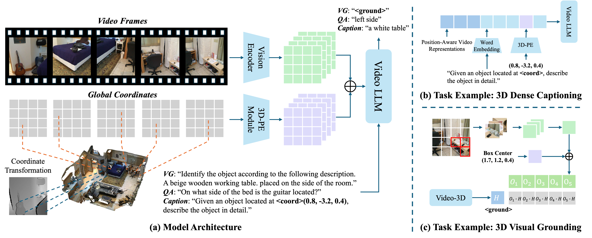

# Video-3D LLM: Learning Position-Aware Video Representation for 3D Scene Understanding

<div align="center" margin-bottom="3em">
    <a href="https://arxiv.org/abs/2412.00493" target="_blank">
    </a>
    <a href="https://huggingface.co/datasets/zd11024/Video-3D-LLM_data" target="_blank">
    </a>
</div>

<div align="center" margin-bottom="3em">
<a target="_blank" href="https://github.com/zd11024">Duo Zheng<sup>*</sup></a>,
<a target="_blank" href="https://sega-hsj.github.io/">Shijia Huang<sup>*</sup></a> and
<a target="_blank" href="https://lwwangcse.github.io/">Liwei Wang<sup>&ddagger;</sup></a>

<br>
<strong>
The Chinese University of Hong Kong<br>
</strong>
<br>
<p style="font-size: 12px;"><sup>*</sup>Equal contribution.
<sup>&ddagger;</sup> Corresponding author.</p>
</div>


<p align="center">
    <br>
</p>
&nbsp;

The rapid advancement of Multimodal Large Language Models (MLLMs) has significantly impacted various multimodal tasks. However, these models face challenges in tasks that require spatial understanding within 3D environments. Efforts to enhance MLLMs, such as incorporating point cloud features, have been made, yet a considerable gap remains between the models' learned representations and the inherent complexity of 3D scenes. This discrepancy largely stems from the training of MLLMs on predominantly 2D data, which restricts their effectiveness in comprehending 3D spaces. 
To address this issue, in this paper, we propose a novel generalist model, i.e., Video-3D LLM, for 3D scene understanding. By treating 3D scenes as dynamic videos and incorporating 3D position encoding into these representations, our Video-3D LLM aligns video representations with real-world spatial contexts more accurately. Additionally, we have implemented a maximum coverage sampling technique to optimize the balance between computational costs and performance efficiency. Extensive experiments demonstrate that our model achieves state-of-the-art performance on several 3D scene understanding benchmarks, including ScanRefer, Multi3DRefer, Scan2Cap, ScanQA, and SQA3D.

## News
- [2024-12-11] We release the processed data of [Video-3D LLM](https://huggingface.co/datasets/zd11024/Video-3D-LLM_data).
- [2024-12-3] We release the paper of [Video-3D LLM](https://arxiv.org/abs/2412.00493).

## TODO List

- \[x\] Release the training code.
- \[x\] Release the evaluation script.
- \[x\] Release the processed data.
- \[ \] Release the model checkpoint.

## Installation
1. Clone this repository and navigate to the Video-3D-LLM:
```bash
git clone https://github.com/LaVi-Lab/Video-3D-LLM.git
cd Video-3D-LLM
```

2. Create the conda environment:
```bash
conda create -n video3dllm python=3.10 -y
conda activate video3dllm
pip install --upgrade pip  # Enable PEP 660 support.
pip install -e ".[train]"
pip install flash-attn --no-build-isolation     # install flash attention
```

## Data Preparation
For data preparation, please refer to this [instruction](scripts/3d/preprocessing/README.md) for detail.

## Training & Inference
### Full-finetuned Training
Our model is **fully fine-tuned** using a combination dataset from five tasks, including ScanRefer, Multi3DRefer, SQA3D, ScanQA, Scan2Cap.
The option `frame_sampling_strategy` in `train_multi.sh` should be set to one of the following options: `['uniform', 'mc-ratio90', 'mc-ratio95']`, and the option `frames_upbound` determines the maximum number of frames used during training phase.
```bash
sh scripts/3d/train/train_multi.sh
```

### Inference
```bash
# example: sh scripts/3d/eval/eval_scan2cap.sh $CKPT uniform 32
sh scripts/3d/eval/eval_scan2cap.sh $CKPT_NAME $SAMPLING_STRATEGY $MAX_FRAMES   
```


## Acknowledgements
We would like to thank the following works for their contributions to the opensourced codebase and community!
* [LLaVA-Next](https://github.com/LLaVA-VL/LLaVA-NeXT/tree/main): the codebase our codebase is built upon.
* [LLaVA-3D](https://github.com/ZCMax/LLaVA-3D), [LEO](https://github.com/embodied-generalist/embodied-generalist), [EmbodiedScan](https://github.com/OpenRobotLab/EmbodiedScan): We refer to these works for the data processing and evaluation setup.
* [ScanNet](https://github.com/ScanNet/ScanNet), [ScanRefer](https://github.com/daveredrum/ScanRefer), [Multi3DRefer](https://github.com/3dlg-hcvc/M3DRef-CLIP), [SQA3D](https://github.com/SilongYong/SQA3D), [ScanQA](https://github.com/ATR-DBI/ScanQA): the datasets we use.


## Citation
If you find our **Video-3D LLM** useful for your research, please consider giving this repository a star and citing our paper as follows:
```
@misc{zheng2024video3dllmlearningpositionaware,
      title={Video-3D LLM: Learning Position-Aware Video Representation for 3D Scene Understanding}, 
      author={Duo Zheng and Shijia Huang and Liwei Wang},
      year={2024},
      eprint={2412.00493},
      archivePrefix={arXiv},
      primaryClass={cs.CV},
      url={https://arxiv.org/abs/2412.00493}, 
}
```